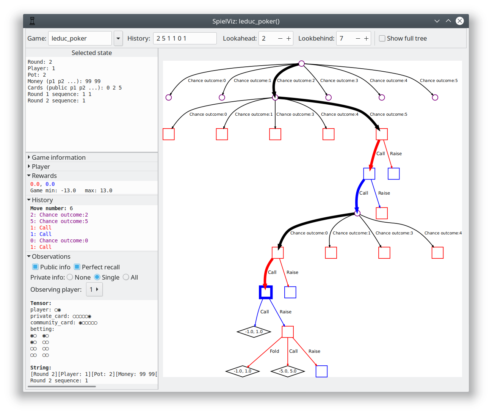

SpielViz
========

_SpielViz_ is an interactive viewer for 
[OpenSpiel](https://github.com/deepmind/open_spiel) games.

It is based on [xdot.py](https://github.com/jrfonseca/xdot.py/), 
a GraphViz's viewer in Python.

Beware that you might not be able to display some games with large branching 
factor and tree lookahead (like Go).

TODOs
=====

PRs are welcome! Feel free to open an issue and state you'd like to contribute.
I will be working on this project probably very sporadically.

 * [ ] Make a warning when building a large graph, allow to cancel.
 * [ ] Show information about the `pyspiel.Game`.
 * [ ] Use keyboard to move withing the Graph (acejump-style).
 * [ ] Add custom game views (state view components) -- down_class python
       bindings for specific games.
 * [ ] Show mapping to public / private trees.
 * [ ] Create a CLI interface that jumps to specific positions in games.
 * [ ] Add a GUI history.
 * [ ] Add a game transformation to OpenSpiel that acts as an action 
       factorization so that we can show games with large branching factor 
       nicely. 
 * [ ] Add game parameter autocompletion.
 * [ ] Make graph presentation more nice -- label sizes, 
       edge expansion location, colors, shapes, highlights, etc.
 * [ ] Add support for bots, showing probabilities of movements / other stats.
 * [ ] Create a snap package and publish in Ubuntu repo.

Features
========

 * Arbitrary loading of games (and game transformations).
 * Jump to specific history.
 * Shows detailed information about `pyspiel.State`.
 * Since it doesn't use bitmaps it is fast and has a small memory footprint.
 * Arbitrary zoom.
 * Keyboard/mouse navigation.
 * Highlights node/edge under mouse.

Install
=======

See [INSTALL.md](INSTALL.md) for details. 

Versioning
==========

We use [Semantic Versioning](https://semver.org/), but no version has been 
released yet - the code is under pure development phase for now.
